# A/N:
- 前言使用中文是因为临时补充
- 项目定义：2D像素得分制小游戏
- 仓库详情：本人于大三上选修课程《游戏引擎设计与开发》中完成的一个**简单课设作业**，源码丢失，仅提供**视频展示**；
- 项目基于udemy上的unity入门课程，在游戏玩法大框架上自行完善内容(详见README的模块二及模块三)
> [^提取码为0830] 视频展示请点击链接查看：[click to check!](https://pan.baidu.com/s/14YvcMMWWdgZkexwLh_pWPg?pwd=0830)

# Base on：
> Basics of C# and Unity for Complete Beginners - Alex Dev: [click to check!](https://www.udemy.com/course/free-part2-alexdev/)

# WHAT I UPDATE：
1. Main Menu & Mouse sprites
2. Beginner Tutorial
3. Animation(sushi destruction and so on...)
4. QTE Buttons
5. Four NEW scenes
6. BONUS & Skill
7. Gun Upgrade (out of bullets & super gun & super bullets)
8. BGM & SFX
9. New Mode
10. Record System

# RESOURCE
- Free ASWESOME assets useds(FROM Alex Dev)
- asset pack - Alex Dev
- Free ASWESOME assets useds(FROM ITCH.IO):
- Farm asset pack - @cupnooble
- UI Sounds - @SoupTonic 
- Music - @Rest! (Ricardo Cuello)

# Showcase
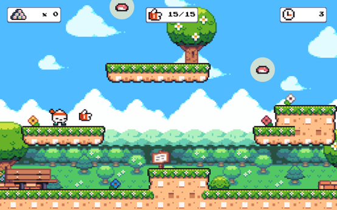
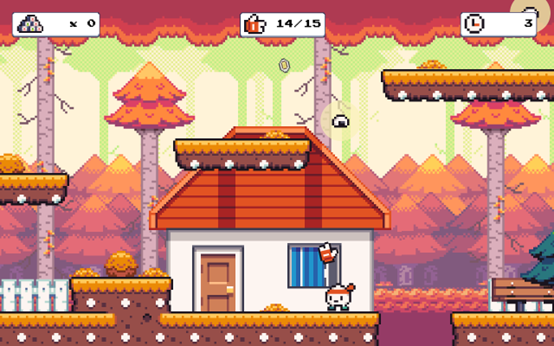
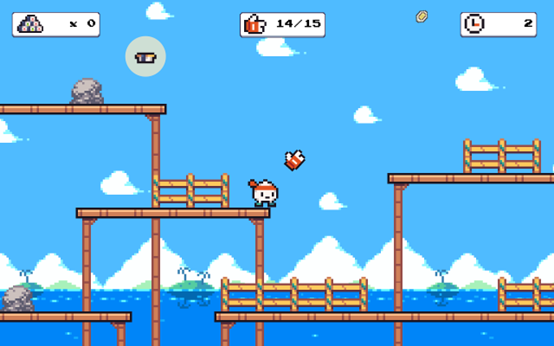
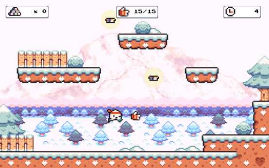
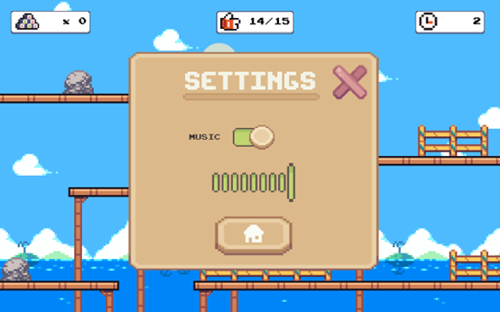
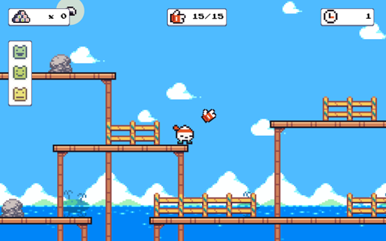
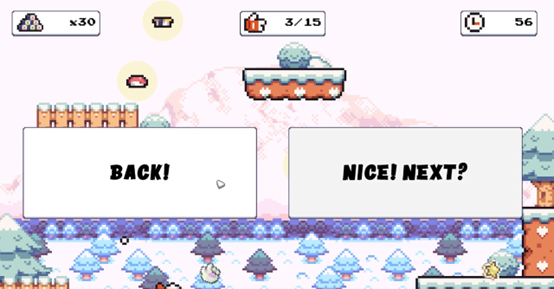
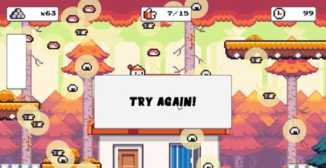
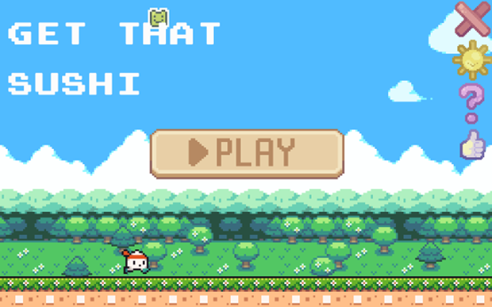
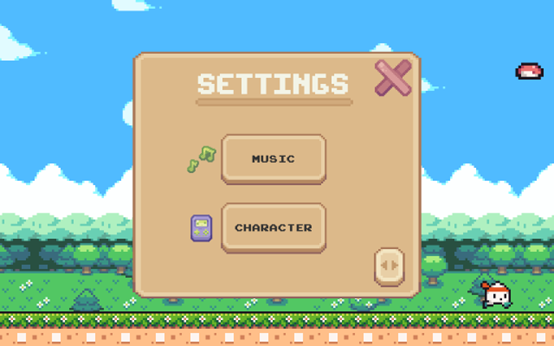
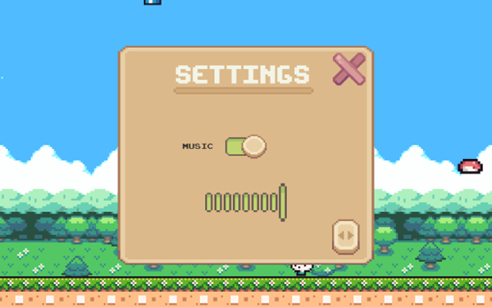
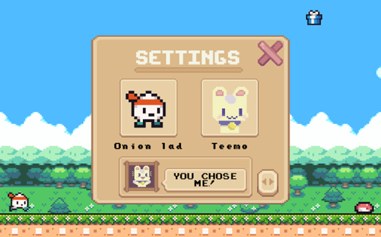
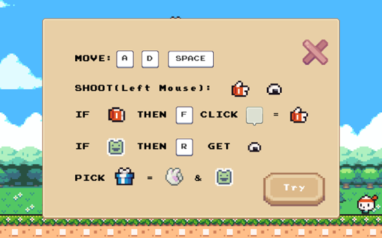
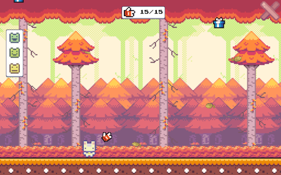
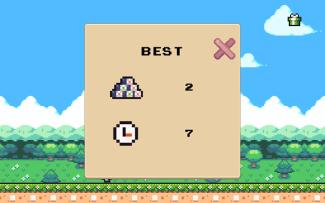
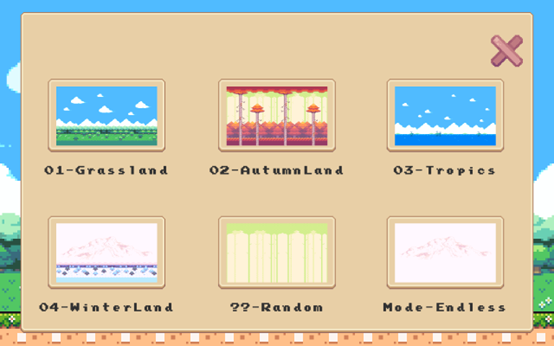
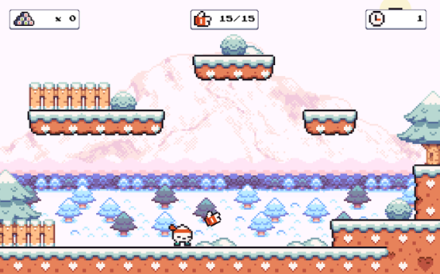
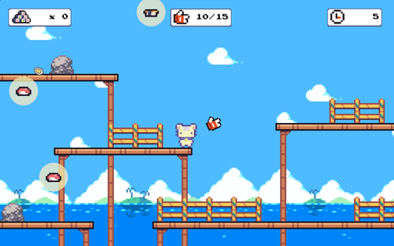
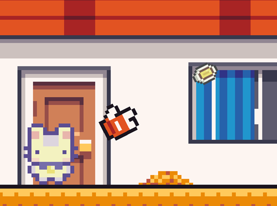
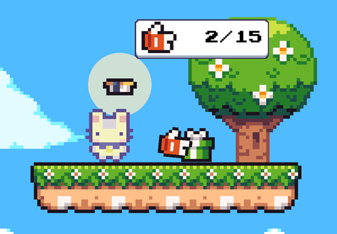
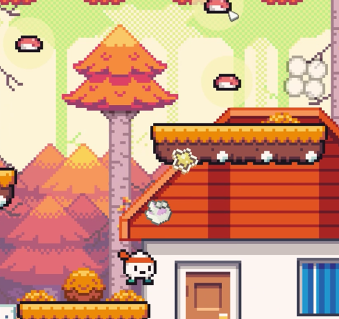
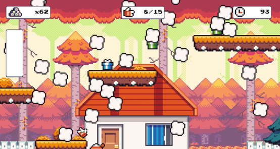
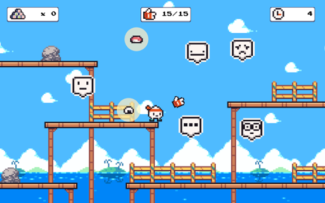
